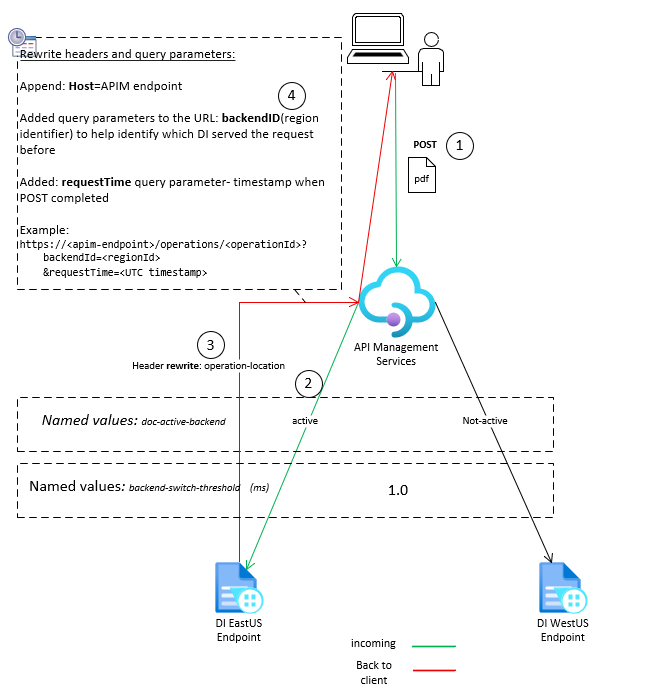
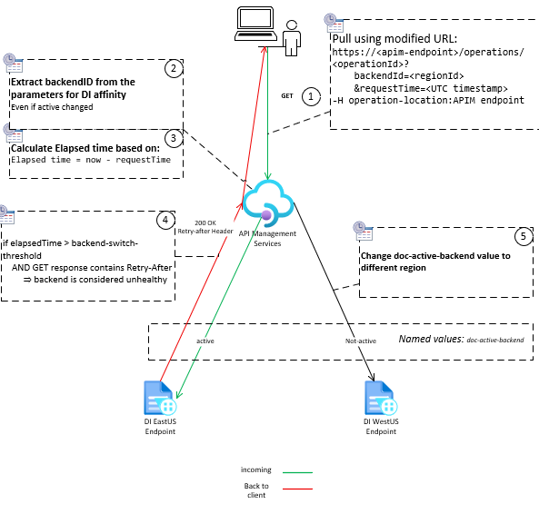

# Azure API Management + Document Intelligence
## Auto-Failover Solution with Load Balancing Pools

[](LICENSE)
[](https://www.terraform.io/)
[](https://azure.microsoft.com/en-us/services/api-management/)

A production-ready, enterprise-grade solution for Azure Document Intelligence with **automatic failover**, **backend load balancing pools**, **circuit breaker protection**, and **comprehensive monitoring**. Built following [Azure Well-Architected Framework](https://learn.microsoft.com/azure/well-architected/service-guides/azure-api-management) best practices.

*Originally created by Anatoly P, enhanced and refactored with Terraform, circuit breakers, and backend pools*

---

## 🌟 Key Features

### Resilience & Reliability
- ✅ **Auto-Failover**: Automatic backend switching when latency exceeds configurable threshold (default: 5 seconds)
- ✅ **Backend Pools**: Priority-based load balancing across multiple Document Intelligence instances per region
- ✅ **Circuit Breaker**: Protection against common Document Intelligence errors (429, 500, 503, 504)
- ✅ **Retry Logic**: Exponential backoff for transient failures
- ✅ **Backend Stickiness**: Maintains consistency for in-flight operations

### Infrastructure as Code
- ✅ **Terraform**: Complete infrastructure automation with modular design
- ✅ **Environment Management**: Separate configurations for dev/prod
- ✅ **Deployment Scripts**: Automated validation and deployment with Python utilities

### Observability
- ✅ **Diagnostic Headers**: Comprehensive request tracking (backend used, duration, switching status)
- ✅ **Circuit Breaker Metrics**: Error classification and circuit status headers
- ✅ **APIM Analytics**: Built-in monitoring and performance tracking
- ✅ **Integration Tests**: Production-like testing with the official Azure SDK

---

## 📊 Architecture

### High-Level Overview

Complete APIM infrastructure with regional Document Intelligence backends, circuit breaker protection, and automatic failover:


**Key Components:**
- API Management gateway with policies
- West & North backend pools (configurable)
- Named values for dynamic configuration
- Automatic health monitoring & failover

### Request Flows - Visual Diagrams

#### POST /analyze - Document Analysis Request

Clients submit documents for analysis. APIM selects the active backend pool and forwards the request with Managed Identity authentication:



**Flow:**
1. Client → POST document to APIM
2. APIM selects active backend pool (from named value)
3. Routes to highest priority instance
4. Document Intelligence returns 202 with Operation-Location
5. APIM rewrites URL to point back through APIM

#### GET /analyzeResults - Results Polling

SDK polls for results using the rewritten Operation-Location URL. APIM calculates request duration and automatically switches backends if processing exceeds threshold:



**Flow:**
1. Client → GET results from APIM
2. APIM extracts backendId from query parameter
3. Routes to SAME backend pool (stickiness)
4. Calculates duration vs configured threshold
5. If duration exceeded, triggers automatic backend switch
6. Returns results with diagnostic headers

### Architecture Components

1. **API Management Layer**
   - Central routing and policy enforcement
   - Managed Identity authentication to Document Intelligence
   - Rate limiting and quota management

2. **Backend Pools** (NEW ✨)
   - **West Pool**: 2-3 Document Intelligence instances in West region
   - **North Pool**: 2-3 Document Intelligence instances in North region
   - Priority-based routing within each pool
   - Automatic health monitoring

3. **Circuit Breaker Protection** (NEW ✨)
   - **Server Errors (500-599)**: 3 errors in 30s → 1min trip
   - **Timeouts (408, 504)**: 5 errors in 30s → 1min trip
   - **Rate Limiting (429)**: 10 errors in 60s → 2min trip

4. **Auto-Failover Logic**
   - Monitors request duration vs threshold
   - Switches active backend pool on exceeded threshold
   - Updates named value via Management API
   - Maintains backend stickiness for in-flight operations

5. **Dynamic Configuration via Named Values** ⚙️
   - All settings stored in APIM Named Values (not hardcoded)
   - Change behavior without redeploying policies
   - Manage from Azure Portal or Terraform
   - Includes: active backend, thresholds, authentication values

---

## 🚀 Quick Start

### Prerequisites

- **Terraform** >= 1.5.0 ([Install](https://www.terraform.io/downloads))
- **Azure CLI** ([Install](https://docs.microsoft.com/cli/azure/install-azure-cli))
- **Python** 3.7+ (for deployment scripts)
- **Azure Resources**:
  - API Management service (Standard v2, Premium, or Premium v2)
  - 2-4 Document Intelligence resources across two regions
  - Managed Identity configured on APIM with:
    - `Cognitive Services User` role on DI resources
    - `API Management Service Contributor` role on APIM

### 1. Clone Repository

```bash
git clone https://github.com/your-org/apim-doc-intel-sample.git
cd apim-doc-intel-sample/ApimDocIntelSample
```

### 2. Configure Environment

```bash
# Copy configuration template
cp terraform/environments/dev.tfvars terraform/environments/dev.auto.tfvars

# Edit configuration with your values
nano terraform/environments/dev.auto.tfvars
```

**Required Configuration:**
```hcl
subscription_id      = "your-subscription-id"
resource_group_name  = "your-rg-name"
apim_service_name    = "your-apim-name"

# Backend endpoints (configure 1-3 per region)
west_backend_endpoints = [
  {
    url      = "https://di-west-1.cognitiveservices.azure.com"
    title    = "DI West Primary"
    priority = 1
  }
]

north_backend_endpoints = [
  {
    url      = "https://di-north-1.cognitiveservices.azure.com"
    title    = "DI North Primary"
    priority = 1
  }
]
```

### 3. Validate Configuration

```bash
python3 deployment/scripts/validate.py -e dev
```

### 4. Deploy Infrastructure

```bash
# Login to Azure
az login

# Deploy
python3 deployment/scripts/deploy.py -e dev
```

### 5. Test the Solution

```bash
# Install test dependencies
pip install -r requirements.txt

# Configure .env file
cp .env.sample .env
# Edit .env with your APIM endpoint and subscription key

# Run integration test
python3 tests/integration/test_automatic_backend_switching.py
```

---

## 🏗️ Project Structure

```
ApimDocIntelSample/
├── terraform/                      # Infrastructure as Code
│   ├── main.tf                     # Main configuration
│   ├── variables.tf                # Input variables
│   ├── outputs.tf                  # Output values
│   ├── environments/               # Environment configs
│   │   ├── dev.tfvars             # Development settings
│   │   └── prod.tfvars            # Production settings
│   └── modules/                    # Terraform modules
│       ├── backend-pools/         # Backend pool configurations
│       ├── named-values/          # APIM named values
│       ├── api/                   # API definitions
│       └── policies/              # Policy templates
│
├── src/                           # Source code and configs
│   ├── policies/                  # APIM policy definitions
│   │   ├── api-level-policy-enhanced.xml
│   │   ├── analyze-operation-policy.xml
│   │   └── analyze-results-operation-policy-enhanced.xml
│   ├── apidefintion/             # API specifications
│   ├── backends/                  # Legacy backend configs
│   └── named-values/             # Legacy named values
│
├── deployment/                    # Deployment automation
│   ├── scripts/
│   │   ├── deploy.py             # Deployment orchestration
│   │   └── validate.py           # Configuration validation
│   └── README.md                 # Deployment documentation
│
├── tests/                        # Test suites
│   ├── integration/
│   │   └── test_automatic_backend_switching.py
│   └── test-data/               # Sample documents
│
├── diagrams/                     # Architecture diagrams
│   ├── APIM-DocIntel-Architecture.drawio
│   ├── POST.png
│   ├── GET.png
│   └── export-diagrams.py       # Diagram export utility
│
└── README.md                     # This file
```

---

## 🔧 Configuration

### 🎯 Named Values (Fully Configurable)

The solution uses **APIM Named Values** for dynamic configuration - no code changes needed to adapt to different environments:

| Named Value | Purpose | Default | Configure In |
|-------------|---------|---------|--------------|
| `doc-active-backend` | Active backend pool ID | `doc-west-pool` | APIM Portal / Terraform |
| `backend-switch-threshold` | Latency threshold (seconds) | `5.0` | APIM Portal / Terraform |
| `azure-subscription-id` | Subscription ID for Management API | From tfvars | APIM Portal / Terraform |
| `azure-resource-group` | Resource group for Management API | From tfvars | APIM Portal / Terraform |
| `azure-apim-service-name` | APIM service name | From tfvars | APIM Portal / Terraform |

**All values are configurable without redeploying policies!** Policies reference these named values using `{{named-value-name}}` syntax.

**To Change Configuration:**
```bash
# Option 1: Update Terraform variables and redeploy
cd terraform
terraform apply -var-file=environments/prod.tfvars

# Option 2: Directly in Azure Portal
# Navigate to: API Management → Named Values
# Edit any value and save (takes effect immediately)
```

### Backend Pools

Configure multiple Document Intelligence instances per region for load balancing:

```hcl
west_backend_endpoints = [
  {
    url      = "https://di-west-primary.cognitiveservices.azure.com"
    title    = "DI West Primary"
    priority = 1  # Highest priority
  },
  {
    url      = "https://di-west-secondary.cognitiveservices.azure.com"
    title    = "DI West Secondary"
    priority = 2  # Fallback
  }
]
```

**Priority-Based Routing:**
- Lower priority values = higher preference
- Requests route to Priority 1 first
- Automatic failover to Priority 2 if Priority 1 unavailable
- Can configure up to 10 backends per pool

### Circuit Breaker Settings

Customize error thresholds in `terraform/variables.tf`:

```hcl
variable "circuit_breaker_threshold" {
  description = "Error rate percentage to trigger circuit breaker"
  type        = number
  default     = 50  # 50% error rate
}

variable "circuit_breaker_timeout" {
  description = "Evaluation window in seconds"
  type        = number
  default     = 30  # 30-second window
}
```

### Backend Switching Threshold

Control when automatic failover occurs:

```hcl
variable "backend_switch_threshold" {
  description = "Latency threshold in seconds"
  type        = number
  default     = 5.0  # Switch after 5 seconds
}
```

---

## 🔍 How It Works

### 1. Document Analysis Request (POST)

```
Client → APIM → Backend Pool (West/North) → Document Intelligence
```

1. Client sends document to `/documentintelligence/documentModels/{modelId}:analyze`
2. APIM reads **named value** `doc-active-backend` to select pool
3. Pool routes to highest priority available instance
4. Managed Identity authenticates request
5. Request timestamp captured for duration tracking
6. DI returns 202 with `Operation-Location` header
7. APIM rewrites header to include:
   - APIM URL (not direct DI URL)
   - `backendId` parameter (e.g., `doc-west-pool`)
   - `requestTime` parameter (ISO timestamp)

**Example Rewritten Header:**
```
Operation-Location: https://your-apim.azure-api.net/doc/documentintelligence/
  documentModels/prebuilt-invoice/analyzeResults/abc123
  ?api-version=2024-11-30&backendId=doc-west-pool&requestTime=2026-01-20T10:30:45.123Z
```

### 2. Results Polling (GET)

```
Client → APIM → Same Backend Pool → Document Intelligence
```

1. SDK automatically polls using `Operation-Location` URL
2. APIM extracts `backendId` parameter
3. Routes request to **same backend pool** as POST (backend stickiness)
4. Calculates duration: `currentTime - requestTime`
5. Compares duration vs **named value** `backend-switch-threshold` (default: 5 seconds)

### 3. Automatic Failover Decision

**Switch Triggers:**
- Duration > threshold (5 seconds)
- Response has `Retry-After` header (operation still pending)
- Managed Identity token available

**Switch Actions:**
1. Determine alternate pool (`doc-north-pool` if currently `doc-west-pool`)
2. Get Managed Identity token for Management API
3. PATCH `/namedValues/doc-active-backend` with new pool ID
4. Add diagnostic headers:
   - `X-Backend-Switched: true`
   - `X-Old-Backend: doc-west-pool`
   - `X-New-Backend: doc-north-pool`
   - `X-Named-Value-Update-Status: 200`

### 4. Circuit Breaker Protection

**Error Detection:**
- Monitors response status codes
- Tracks error rates within time windows
- Opens circuit when thresholds exceeded

**Circuit States:**
- **Closed**: Normal operation, requests flow through
- **Open**: Too many errors, requests fail fast
- **Half-Open**: Testing if backend recovered

**Example Headers:**
```
X-Circuit-Breaker-Status: RateLimitDetected
X-Circuit-Breaker-Error: RateLimitExceeded
X-Error-Type: TooManyRequests
```

---

## 📈 Monitoring & Observability

### Diagnostic Headers

Every response includes comprehensive tracking headers:

```http
# Backend Information
X-Backend-Used: doc-west-pool
X-Processing-Backend: doc-west-pool
X-Configured-Backend: doc-west-pool
X-Requested-Backend: doc-west-pool

# Duration Tracking
X-Request-Duration: 7.23
X-Duration-Threshold: 5.0
X-Duration-Threshold-Exceeded: true

# Switching Information
X-Backend-Switched: true
X-Switch-Reason: Duration 7.23s exceeded 5.0s threshold
X-Old-Backend: doc-west-pool
X-New-Backend: doc-north-pool
X-Named-Value-Update-Status: 200

# Circuit Breaker Status
X-Circuit-Breaker-Status: Healthy
X-Error-Type: None
```

### APIM Analytics

Built-in monitoring available in Azure Portal:
- Request volume and latency
- Error rates by status code
- Backend health and availability
- Circuit breaker trips
- Policy execution traces

### Application Insights (Optional)

Integrate with Application Insights for advanced monitoring:
1. Enable Application Insights on APIM
2. Configure sampling rate
3. Query traces with custom dimensions

---

## 🧪 Testing

### Integration Testing

Validates automatic backend switching with production-like scenarios:

```bash
# Run test suite
python3 tests/integration/test_automatic_backend_switching.py

# Use custom document
python3 tests/integration/test_automatic_backend_switching.py \
  --sample tests/test-data/large.pdf

# Configure via environment variables
export BACKEND_SWITCH_TEST_SAMPLE="large.pdf"
export BACKEND_SWITCH_TEST_POLL_INTERVAL=1
export BACKEND_SWITCH_TEST_DELAY=2
```

**Test Output:**
```
|  #  | Method | ResponseCode | BackendUsed    | Duration | Threshold Exceeded | Switched | Status |
|-----|--------|--------------|----------------|----------|-------------------|----------|--------|
|  1  | POST   | 202          | doc-west-pool  |          |                   |          | OK     |
|  1  | GET    | 200          | doc-west-pool  | 7.23s    | true              | YES      | OK     |
|  2  | POST   | 202          | doc-north-pool |          |                   |          | OK     |
|  2  | GET    | 200          | doc-north-pool | 6.87s    | true              | YES      | OK     |
```

**Success Criteria:**
- ✅ Backend switching detected (`X-Backend-Switched: true`)
- ✅ No 404 errors (correct backend routing)
- ✅ Duration calculation accurate
- ✅ All diagnostic headers populated

### Load Testing

Use Azure Load Testing for production validation:

```bash
# Install Azure Load Testing CLI extension
az extension add --name load

# Create load test
az load test create \
  --name apim-load-test \
  --resource-group your-rg \
  --load-test-resource your-load-test-resource

# Run test
az load test run \
  --test-id apim-load-test \
  --parameters url=https://your-apim.azure-api.net/doc
```

---

## 🔐 Security Considerations

### Current Implementation

- ✅ **Managed Identity**: APIM → Document Intelligence authentication
- ✅ **Managed Identity**: APIM → Management API authentication
- ✅ **Subscription Keys**: Client → APIM authentication
- ✅ **HTTPS Only**: Encrypted communication
- ✅ **Header Stripping**: Prevents credential leakage

### Production Recommendations

#### 1. Replace API Keys with Managed Identity

```xml
<!-- Update client authentication to use Managed Identity -->
<authentication-managed-identity resource="your-apim-service.azure-api.net" />
```

#### 2. Implement Private Endpoints

```hcl
# Add to Document Intelligence resources
resource "azurerm_private_endpoint" "di" {
  name                = "di-private-endpoint"
  location            = var.location
  resource_group_name = var.resource_group_name
  subnet_id           = var.subnet_id

  private_service_connection {
    name                           = "di-connection"
    private_connection_resource_id = azurerm_cognitive_account.di.id
    subresource_names              = ["account"]
  }
}
```

#### 3. Use Azure Key Vault

Store sensitive configuration in Key Vault:

```hcl
# Named value from Key Vault
resource "azurerm_api_management_named_value" "from_kv" {
  name                = "sensitive-config"
  api_management_name = var.apim_name
  resource_group_name = var.resource_group_name
  display_name        = "sensitive-config"
  
  value_from_key_vault {
    secret_id = azurerm_key_vault_secret.config.id
  }
}
```

#### 4. Network Isolation

Deploy APIM in virtual network:

```hcl
resource "azurerm_api_management" "apim" {
  # ... other config ...
  
  virtual_network_type = "Internal"
  
  virtual_network_configuration {
    subnet_id = azurerm_subnet.apim.id
  }
}
```

---

## 🔄 CI/CD Integration

### GitHub Actions

```yaml
name: Deploy APIM Solution

on:
  push:
    branches: [main]
  pull_request:
    branches: [main]

jobs:
  validate:
    runs-on: ubuntu-latest
    steps:
      - uses: actions/checkout@v3
      
      - name: Setup Python
        uses: actions/setup-python@v4
        with:
          python-version: '3.10'
      
      - name: Setup Terraform
        uses: hashicorp/setup-terraform@v2
        with:
          terraform_version: 1.5.0
      
      - name: Azure Login
        uses: azure/login@v1
        with:
          creds: ${{ secrets.AZURE_CREDENTIALS }}
      
      - name: Validate Configuration
        run: |
          python3 deployment/scripts/validate.py -e prod

  deploy:
    needs: validate
    if: github.ref == 'refs/heads/main'
    runs-on: ubuntu-latest
    steps:
      - uses: actions/checkout@v3
      
      - name: Setup Tools
        uses: hashicorp/setup-terraform@v2
      
      - name: Azure Login
        uses: azure/login@v1
        with:
          creds: ${{ secrets.AZURE_CREDENTIALS }}
      
      - name: Deploy Infrastructure
        run: |
          python3 deployment/scripts/deploy.py -e prod --auto-approve
```

### Azure DevOps

```yaml
trigger:
  branches:
    include:
      - main

variables:
  terraform_version: '1.5.0'
  python_version: '3.10'

stages:
  - stage: Validate
    jobs:
      - job: ValidationJob
        pool:
          vmImage: 'ubuntu-latest'
        steps:
          - task: UsePythonVersion@0
            inputs:
              versionSpec: $(python_version)
          
          - task: TerraformInstaller@0
            inputs:
              terraformVersion: $(terraform_version)
          
          - task: AzureCLI@2
            inputs:
              azureSubscription: 'Azure-ServiceConnection'
              scriptType: 'bash'
              scriptLocation: 'inlineScript'
              inlineScript: |
                python3 deployment/scripts/validate.py -e prod

  - stage: Deploy
    dependsOn: Validate
    condition: and(succeeded(), eq(variables['Build.SourceBranch'], 'refs/heads/main'))
    jobs:
      - deployment: DeployJob
        environment: 'Production'
        pool:
          vmImage: 'ubuntu-latest'
        strategy:
          runOnce:
            deploy:
              steps:
                - checkout: self
                
                - task: AzureCLI@2
                  inputs:
                    azureSubscription: 'Azure-ServiceConnection'
                    scriptType: 'bash'
                    scriptLocation: 'inlineScript'
                    inlineScript: |
                      python3 deployment/scripts/deploy.py -e prod --auto-approve
```

---

## 📚 Documentation

- **[Terraform Infrastructure](terraform/README.md)** - Detailed Terraform documentation
- **[Deployment Scripts](deployment/README.md)** - Deployment automation guide
- **[Backend Pools Module](terraform/modules/backend-pools/README.md)** - Backend pool configuration
- **[Architecture Diagrams](diagrams/README.md)** - Diagram export instructions
- **[Testing Guide](tests/README.md)** - Test suite documentation

### External Resources

- [Azure APIM Best Practices](https://learn.microsoft.com/azure/well-architected/service-guides/azure-api-management)
- [Azure Document Intelligence](https://learn.microsoft.com/azure/ai-services/document-intelligence/)
- [APIM Policy Reference](https://learn.microsoft.com/azure/api-management/api-management-policies)
- [Terraform Azure Provider](https://registry.terraform.io/providers/hashicorp/azurerm/latest/docs)

---

## 🤝 Contributing

Contributions are welcome! Please follow these guidelines:

1. **Fork the repository**
2. **Create a feature branch**: `git checkout -b feature/amazing-feature`
3. **Commit your changes**: `git commit -m 'Add amazing feature'`
4. **Push to the branch**: `git push origin feature/amazing-feature`
5. **Open a Pull Request**

### Development Workflow

1. Make changes in development environment
2. Test with integration test suite
3. Validate with `validate.py` script
4. Deploy to dev: `python3 deployment/scripts/deploy.py -e dev`
5. Verify functionality
6. Create PR with detailed description

---

## 🐛 Troubleshooting

### Common Issues

#### "Backend switching not occurring"

**Check:**
- Named value `backend-switch-threshold` is set correctly
- Request duration exceeds threshold
- Response has `Retry-After` header
- Managed Identity has permissions on APIM

**Verify:**
```bash
# Check headers in response
curl -v -H "Ocp-Apim-Subscription-Key: YOUR_KEY" \
  "https://your-apim.azure-api.net/doc/..."
```

#### "404 errors on polling"

**Cause:** Backend stickiness not working
**Fix:** Ensure `backendId` query parameter is present in `Operation-Location`

#### "Circuit breaker not triggering"

**Check:**
- Error rate exceeds threshold
- Time window configured correctly
- Backend pool circuit breaker rules defined

#### "Terraform apply fails"

**Common causes:**
- Azure authentication expired: `az login`
- Resource name conflicts
- Insufficient permissions
- Invalid configuration values

**Debug:**
```bash
# Enable detailed logging
export TF_LOG=DEBUG
terraform apply -var-file=environments/dev.tfvars
```

---

## 📄 License

This project is licensed under the MIT License - see the [LICENSE](LICENSE) file for details.

---

## 👥 Authors

- **Anatoly P** - *Initial implementation* - Original APIM routing solution
- **TzahiA** - *Refactoring & enhancement* - Terraform, circuit breakers, backend pools

---

## 🙏 Acknowledgments

- Azure API Management team for excellent documentation
- Microsoft Well-Architected Framework for best practices guidance
- draw.io for architecture diagramming tool
- Terraform community for infrastructure modules

---

## 📞 Support

For issues, questions, or contributions:
- **Issues**: [GitHub Issues](https://github.com/your-org/apim-doc-intel-sample/issues)
- **Discussions**: [GitHub Discussions](https://github.com/your-org/apim-doc-intel-sample/discussions)
- **Documentation**: See [README.md](README.md) and module-specific guides

---

## 🗺️ Roadmap

### Planned Features

- [ ] Multi-region APIM deployment with Traffic Manager
- [ ] Azure Monitor integration with custom dashboards
- [ ] Automated load testing in CI/CD pipeline
- [ ] Support for additional Document Intelligence models
- [ ] WebSocket support for real-time updates
- [ ] GraphQL API gateway option
- [ ] Kubernetes integration guide

### Version History

- **v2.0.0** (2026-01-20) - Terraform refactor, circuit breakers, backend pools
- **v1.0.0** (2024-12-01) - Initial release with auto-failover

---

<div align="center">

**Built with ❤️ using Azure, Terraform, and Python**

[⬆ Back to top](#azure-api-management--document-intelligence)

</div>


